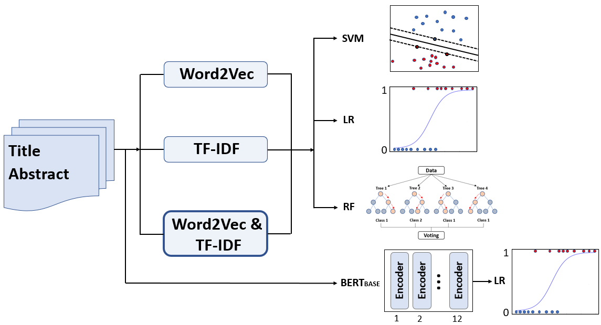
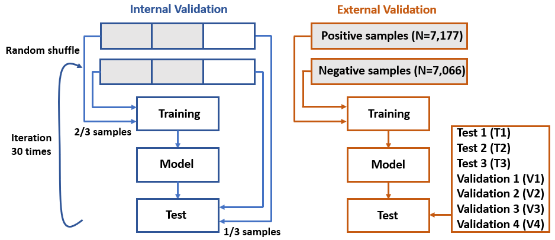
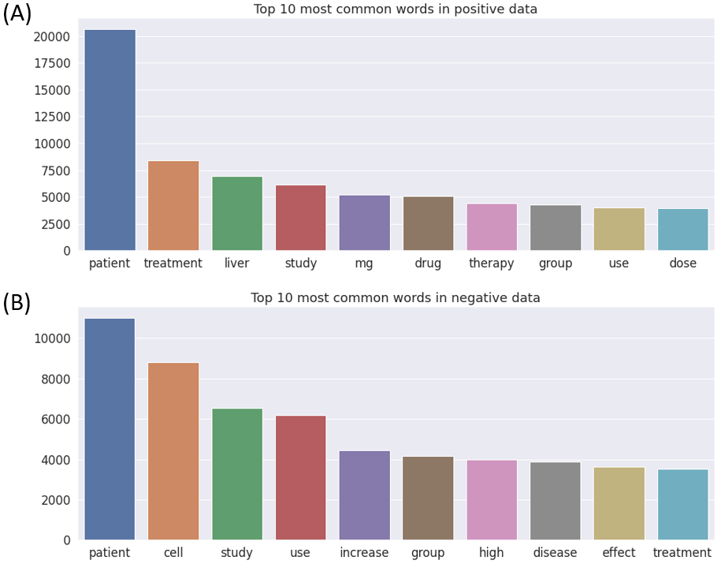
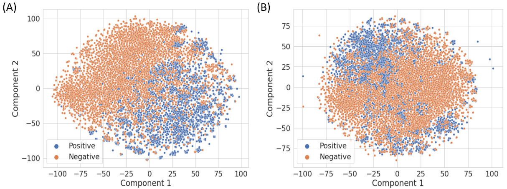

# Improved prediction of drug-induced liver injury literature using natural language processing and machine learning methods

**Challenge:** The Critical Assessment of Massive Data Analysis (CAMDA) 2022 in collaboration with the Intelligent Systems for Molecular Biology (ISMB) hosted the Literature AI for Drug Induced Liver Injury (DILI) challenge.  

## A pipeline of data analysis using natural language processing in conjunction with machine learning methods

## Internal and external validation strategy

## The top 10 most common words in (A) DILI-related and (B) unrelated literature

## The t-SNE visualization of the TF-IDF vectors obtained using (A) the title and abstract and (B) only the title of each publication

1. Model Building  
   - PathCNN.py  
   -
2. GradCAM  
   - PathCNN_GradCAM_modeling.py: to generate a model for GradCAM (PathCNN_model.h5)
   - PathCNN_GradCAM.py: to generate GradCAM images and a resultant file (pathcnn_gradcam.csv)
   
3. Data
   - All data were made available to participants by the CAMDA challenge organizers. Requests to access data should be directed to CAMDA Challenge: http://camda.info/.
